## CXL诞生的背景
随着人工智能大模型（如670B参数的deepseek）、高性能计算、云原生应用的快速发展，传统计算架构面临根本性瓶颈。CPU与GPU、FPGA等异构加速器之间的协作效率低下，内存带宽增速远落后于算力需求，数据中心资源利用率不足等问题日益突出。在此背景下，CXL(Compute Express Link)于2019年由英特尔牵头推出，旨在通过统一缓存一致性协议和硬件解耦技术，重构计算、内存、存储的协作方式。随着云计算、人工智能、大数据分析、高性能计算需求的出现，计算需求和数据处理器的复杂性在不断增长，随之而来的是巨大的算力和存储需求。
### 当前计算和存储架构的三大挑战
1. 内存墙问题
    - 算力与存储资源的不平衡：CPU算力提升远超DRAM带宽提升，导致CPU大量算力浪费在数据等待。
    - 扩展天花板：
        - DDR5单通道50GB/s需200引脚，PCIe 5.0同等引脚实现256GB/s
        - 3D堆叠DRAM成本达传统方案3倍，2DPC方案带宽提升不足20%
    - 容量瓶颈：DRAM密度提升受限于散热能力，单芯片容量增速降至年10%。
2. 数据中心资源搁浅
    - 数据中心为了处理峰值的工作负载需求，每台服务器都配置了过量的内存和加速器，这导致数据中心的总体拥有成本(TCO)中内存占比逐年上升。由于资源的紧密耦合(其中计算、内存和 I/O 设备仅属于一台服务器)，导致在空闲时段，大量资源被闲置。
        - 阿里云实测显示，AI推理集群在非高峰时段内存闲置率高达45%，而突发任务又因局部资源不足排队。
        - Microsoft Azura数据中心的实测数据显示有超过25%的内存出现搁浅。
3. 异构设备间的一致性通信问题
    - 协议碎片化：NVIDIA NVLink、AMD Infinity Fabric等私有协议互不兼容，跨厂商设备协作需依赖低效的软件模拟一致性。
    - 缓存同步开销：传统PCIe缺乏硬件级缓存一致性，GPU与CPU通信需手动刷新缓存，增加20%-40%的软件复杂度（如PyTorch框架中的显式同步操作）。

### CXL的应对策略
针对上述挑战，CXL通过三大核心技术实现突破：

- 缓存一致性协议（CXL.cache）：允许CPU与加速器共享缓存，消除冗余数据拷贝（如AI训练中梯度数据可直接同步）。

- 内存池化（CXL.mem）：将DRAM/NVM组成共享资源池，支持TB级内存动态分配（如云计算中按需调配内存资源）。

- 协议兼容性（CXL.io）：基于PCIe物理层实现跨厂商设备互连，打破生态壁垒（如英特尔CPU与AMD GPU直接通信）。

### CXL发展历程
CXL（Compute Express Link）协议自其诞生以来，经历了快速的发展和演进，旨在解决现代计算系统中内存和计算资源的紧耦合问题，实现更灵活的内存扩展和高效的异构计算支持。英特尔利用二十多年来开发 PCI-Express 的经验，在2019年3月里程碑式地开源了CXL 1.0规范，主要支持三种协议——CXL.io、CXL.mem和CXL.cache，分别用于传统I/O操作、内存访问扩展和缓存一致性，已经具备了主机和CXL设备点对点一致性连接的完整协议链路。

- 在2019年9月英特尔与阿里巴巴、思科、戴尔、谷歌、华为、Meta、Microsoft 和 HPE 成立了 CXL 联盟，并推出了CXL1.1，主要增加了合规性测试机制。
- 2020年11月，CXL 2.0规范发布，引入单级交换机和多逻辑设备概念，支持内存池化 (Memory Pooling) ，新增链路级完整性和数据加密(IDE，link-level integrity and Data Encryption)；
- 2022年8月，CXL 3.0规范发布，扩展到多层交换结构、物理链路升级到PCIe 6.0、支持内存共享（Memory Sharing）。
- 2023年11月 CXL 3.1规范发布，进一步扩展了交换结构、增强内存功能，新增基于安全执行环境的安全协议。
- 2024年12月 CXL 3.2规范发布，聚焦于内存效率、安全性和互操作性。 
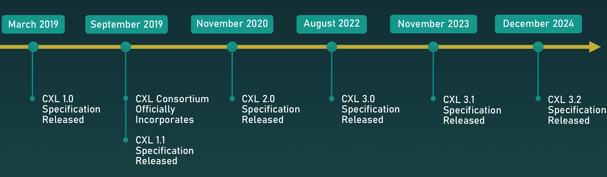
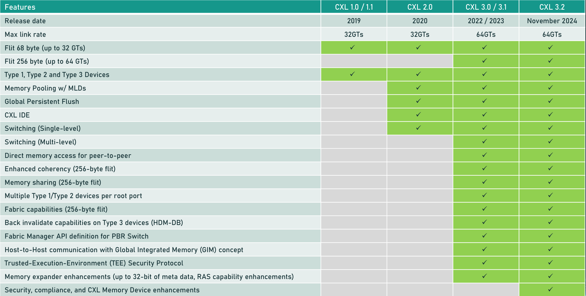

## CXL三种设备
CXL一共拥有三类设备：

- Type1 device：依赖host的memory
    - 需要一个完全一致的缓存来访问宿主的内存。
    - 支持使用CXL缓存链路层的设备：设备可以缓存宿主的内存。
    - 可以在其上实现任何内存一致性模型。
    - 特殊功能：支持无限数量的原子操作。
- Type2 device：local memory + host memory

    - 支持所有三种协议：CXL.io、CXL.cache和CXL.mem
    - 设备额外拥有内存（如DDR、HBM等）
    - 设备具备缓存 + 内存（设备管理的一致性）
    - 设备内存可以是私有的，也可以与宿主共享
- Type3 device:
    - 支持CXL.io和CXL.mem协议
    - 不操作宿主内存
    - 作为内存扩展器使用
    - 没有计算单元
    - 它不参与缓存一致性，而是处理来自宿主发送的请求

## CXL子协议
CXL协议由三个协议组成，分别是CXL.io、CXL.cache和CXL.mem协议。其中CXL.io功能等同于PCIe，在电气层和物理层上复用PCIe接口。CXL.cache协议允许device缓存host的内存，实现host和device之间的缓存一致性。CXL.mem允许host以load/store语义去访问device的内存，就像访问host的本地内存。

CXL是一种非对称的一致性协议，在Host中集成一个home agent，由host统一管理所有device的缓存一致性，而非device与device之间直接协调，device中仅仅需要实现一个简单的MESI协议。

<!-- 为了最快的说明CXL，先从CXL 1.1开始讲起。 -->

PCIe使用分层协议，分别是物理层、数据链路层和事务层。CXL在PCIe物理层上多路复用其三种协议。每个协议的传输单元为 Flit（流控制单元）。

其中CXL.io复用了数据链路层和事务层。而CXL.cache和CXL.mem分别实现了自己的数据链路层和事务层。

CXL1.0、1.1、2.0定义了68Byte-Flit，CXL3.0定义了256Byte-Filt。
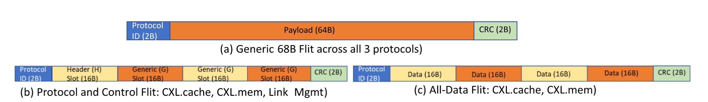

### CXL.io
- **继承性**：CXL.io 直接基于 PCIe 5.0 的物理层和链路层，兼容其电气特性与基础协议栈。
    
- **扩展功能**：在 PCIe 基础上，CXL.io 增加了对 CXL 设备（如加速器、内存扩展卡）的发现、配置和高效 I/O 虚拟化的支持。
    
- **定位**：CXL.io 是 CXL 协议的“基础层”，与 CXL.cache（缓存一致性）和 CXL.mem（内存访问）共同构成完整的 CXL 协议栈

### CXL.cache
- CXL.cache允许device缓存host的主存，并且规定CXL device中的cache使用MESI协议来维护cache coherent
- CXL.cache实现的是非对称一致性协议，host中集成一个home agent，由host统一管理所有device的缓存一致性,在设备中实现一个DOCH(Device Coherence Engine)负责响应。所以CXL设备不需要直接与任何同级缓存交互，而只需要跟Home Agent交互。其中Home Agent通过发送Snoop请求给同级缓存进行一致性的维护，为了减少不必要的一致性流量，Home Agent会实现一个叫Snoop Filter的结构。
- CXL.cache所有请求地址都是host的物理地址，在CXL设备中可以实现一个DTLB来加快地址翻译过程，DTLB的表项可以通过PCIe提供的地址翻译服务（ATS）向主机进行请求。
- CXL.cache传输的数据粒度始终为64B

CXL.cache是一个双向cache一致性协议，分为两个方向：D2H，H2D。每个方向上又有三个通道：Request、Response以及Data。

        
#### D2H request
D2H Request一共有15条commands，可以分为4类：Read、Read0、Read0-Write以及Write。
- Read：进行读操作，需要最新的数据
    - RdCurr：获取数据后不缓存。
    - RdOwn：读数据同时获取独占的权限
    - RdShared：只是读数据，不获取独占权限
    - RdAny：获取数据后可以是任何状态，默认是缓存的

- Read0：发送读请求但是不需要数据
    - RdOwnNoData：已经有数据，但是需要获取独占的权限
    - CLFlush：无效同级的缓存行，如果是脏数据在无效前先写回
    - CacheFlushed：表示一种确认，自己缓存行已经完成冲刷，用于帮助Home Agent更新Snoop Filter
- Read0-Write：允许Device在发出请求之前无需任何一致性状态，即可直接向Host写入数据（**原子性操作，先获取独占权限（Read0）再写入数据（Write），合并为单次请求。**）。
    - ItoMWr：Home Agent收到请求后首先获取写权限，不需要传递最新的数据给CXL Device，因为接着CXL设备会对整个缓存行进行写入，写完后CXL设备还是处于I状态
    - WrCur(CXL3.0更名)/MemWr(旧名字)：跟ItoMWr一样，CXL设备只负责提供写入的数据，不会缓存数据。跟ItoMWr不一样的地方是CXL提供的数据写入的位置。MemWr只有在缓存命中的时候才会写入到缓存中，否则直接写到内存中。而ItoMWr只要在memory之前有缓存层级，不管是否命中，都会写到缓存中，而不会写到内存中去。

- Write：将数据写回Host，同时将Device中对应的cache line状态设置为I。
    - CleanEvict和DirtyEvict都是将自己的数据写到Host中，自己无效掉；
    - CleanEvictNoData：不会向host发送数据，只需要通知Host自己静默驱逐啦，让Host修改snoop Filter的表项。
    - WOWrInv: weakly order 部分写，它的响应是FastGO（Global Observation），不提供GO语义；（Home Agent收到WOWrInv请求后，不用等维护一致性所有的Snoop请求全部收到响应，就可以发送FastGo+WritePull组合响应给CXL设备侧，即这个时候并不保证写全局可见，但是可以更快地完成写请求。如果需要全局可见，需要等到最后收到了ExtCmp消息）
    - WOWrInvF：weakly order 整个缓存行写入
    - WrInv：strong order 写(不区分是否整行写入，最后还会收到Go_I表示全局可见)

#### H2D request
H2D 请求通道用于主机更改设备中的缓存一致性状态，这被称为“Snooping”（缩写为 Snp）。设备必须根据 Snoop 类型更新其缓存，并且在缓存中有脏数据（M 状态）的情况下，还必须将数据返回给主机。
H2D Request消息由三种：SnpData、SnpInv、SnpData

- SnpData
  - 缓存状态降级为共享状态，但必须返回任何修改的数据
  - 这些是来自主机的对要缓存的行的 snoop 请求, 这些缓存行打算在请求者是 Shared 或 Exclusive 状态（Exclusive 状态可以缓存在仅当所有设备都以 RspI 响应时的请求者）。 这种类型的 snoop 通常是由数据读取请求触发。 接收此侦听的设备必须要么使所有缓存行无效或降级为共享状态。 如果设备持有脏数据必须归还给Host
- SnpInv
  - 缓存行降级为无效，必须返回任何修改的数据
  - 这些是来自主机的对打算授予所有权的缓存行的 snoop 请求，缓存行在请求者中是独占状态。专门为Write类请求服务，获取缓存行独占权限。接收此监听的设备必须使所有高速缓存行无效。 如果设备持有脏数据，它必须将其返回给主机。
- SnpCur
  - 缓存状态不变，必须返回任何修改的数据
  - 这个 snoop 获取缓存行的当前版本，但不需要更改任何缓存层次结构中的状态。它仅为了 RdCurr 请求发送。如果设备保存处于修改状态的数据，它必须将其返回给主机。 缓存状态可以保持设备和主机都没有变化，主机不应该更新它的缓存。

#### H2D response
-  WritePull
   -  WritePull 专门为WrInv/WrCur设计的，让CXL设备提供需要写入的数据，当前的请求交易还没有结束；Host接收数据写入后再发送Go-I表示事务完成，全局可见。
-  GO
   -  全局观察（GO）消息表明读请求是连贯的，写请求是连贯且一致的。Go表示读或者写请求已经全局可见；并且可以携带MESI的状态，即CXL设备的缓存应该处于的状态；
 - GO_WritePull
   - 这是一个组合的 GO + WritePull 消息。 不携带MESI状态消息；主要用于不需要后续再发送一个Go消息来确认写入的数据已经全局可见的写请求。（比如CleanEvict或者DirtyEvict）
 - ExtCmp
   - 这个响应表明之前本地排序的数据（FastGO）有在整个系统中已经被观察。 最重要的是，对内存的访问将返回最新的数据。
 - GO_WritePull_Drop
   - 此消息与 Go_WritePull 具有相同的语义，除了设备应该不向主机发送数据。
 - Fast_GO_WritePull
   - 类似于GO_WritePull，但仅表示该请求在本地被观察到。当事务在内存中完全可观察时，稍后会发送ExtCmp消息。未实现Fast_GO功能的设备可以忽略GO消息并等待ExtCMP。对于WritePull，必须始终发送数据。不会将缓存状态传输到设备。  
   - 在本上下文中，“本地观察”是指特定于主机的相干域，它可能是全局相干域的子集。例如，请求设备与其他CXL.cache设备共享的末级缓存（Last Level Cache），这些设备连接在主机桥下方。在该示例中，本地观察仅在末级缓存内进行，而不是在其他末级缓存之间。
 - GO_ERR_WritePull
   - 跟GO_WritePull拥有类似的语义，代表事务出现了错误，CXL设备还是需要提供数据，但是主机会丢弃这个数据

#### D2H response
device在收到Host发来的H2D Request后，进行应答，发送D2H Response。
D2H Response消息共有七种，D2H Response 的 Opcode 的名字格式很有规律，Rsp+X+Hit/Fwd+Y，A 表示新的缓存行状态，B 是原来的缓存行状态，Hit 不附带数据，Fwd 附带数据
- X、Y可以为V、SE、M、I、其中V代表MESI种MES三种状态。

- RspXHitY —> CXL设备在Y状态下命中，同时响应后处于X状态；
- RspS(I)FwdM —> 表示CXL设备的缓存之前是M状态，后续变成了S/I，并随后会把数据传给Host
- RspVFwdV —> 表示CXL设备缓存之前的状态是M/E，后续保存不变，同时会把数据传给Host；

#### example
缓存一致性所涉及的内存层次结构：
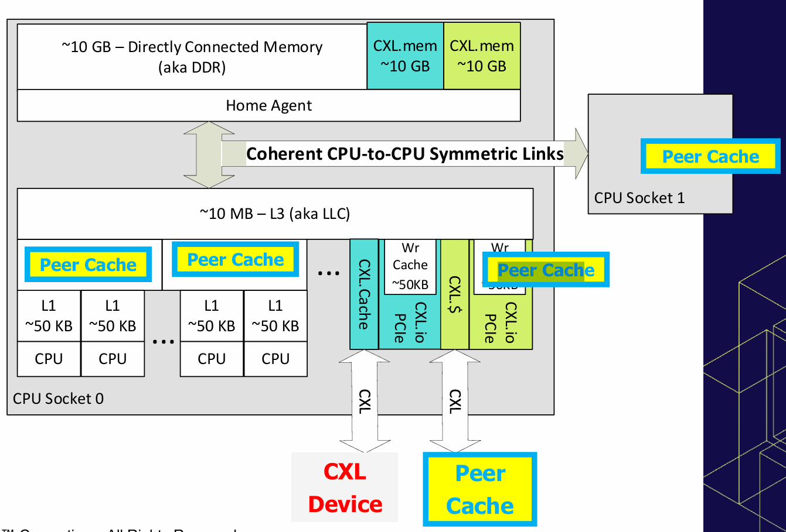

这里的Peer Cache可以是下面任意一种：
- CXL的邻居设备
- 本CPU中的cache
- 远端CPU中的cache

这里的内存控制器也可以是各种内存：
- 本CPU的传统DDR
- 远端CPU的传统DDR
- 邻居CXL设备上的CXL.mem

##### Read
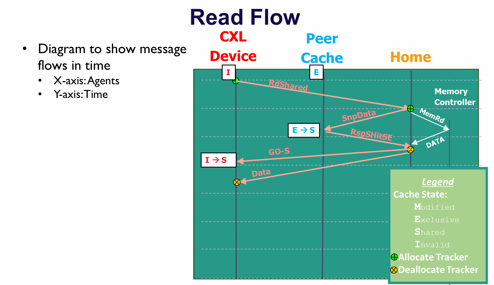
- CXL设备在D2H的Req通道发送RdShare给Home Agent用于读数据。Home Agent一般会有snoop filter，记录着哪些peer cache可能有这个数据的副本。home agent接收到RdShared后一边在H2D的Req通道发送SnpData嗅探请求给有数据的peer cache，一边向内存发送读请求。
- peer cache接受到SnpData请求后，并没有传递数据，而是在D2H的Resp通道返回了RspSHitSE，表示自己之前是S或者E状态，现在变成了S状态。即peer cache中没有修改过的数据，从内存中获取的数据就是最新的。
- Home Agent从Memory获得数据，以及所有的嗅探结束后，才能向最初的请求者发送GO响应。其中，GO消息还附带MESI状态信息，用于指示缓存需要切换到的目标状态。在上面的例子中由于还存起其他的副本，所以返回的是GO-S；
##### Write
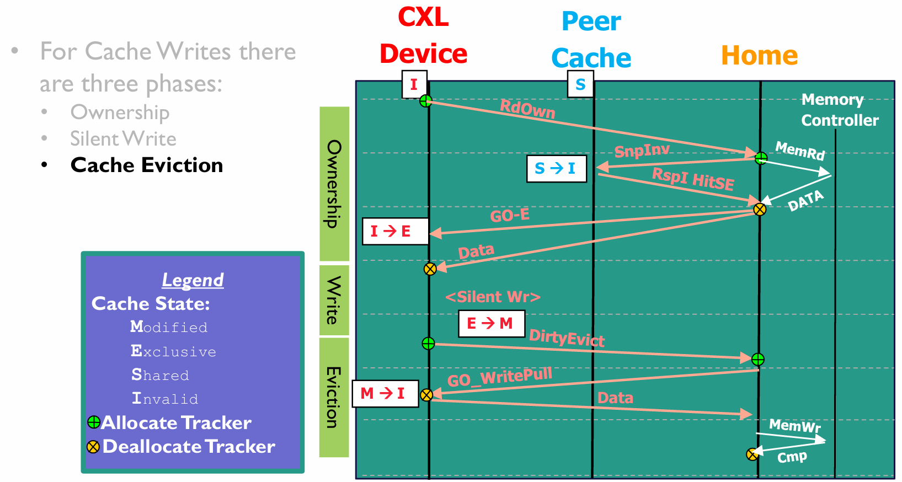
- CXL设备首先发送RdOwn请求来获得写权限，Home Agent发送SnpInv给所有有副本的缓存。如果peer cache没有脏的数据直接回复RspIHitSE/RspIHitI；如果有脏的数据需要返回RspIFwdM，同时将数据通过D2H Data通道写回去。
- 在这个例子中我们看到Home agent把所有的peer cache无效掉，并没有从缓存中获得数据，所以从memory中返回的数据就是最新的。然后发送Go-E和Data给发起者。
- CXL设备获得写权限后，进行写入操作，缓存行状态从E变成了M；
- 后续这个脏的缓存行可能由于缓存满了需要被替换出去，就需要发送DirtyEvict的写回请求给Home Agent；HomeAgent响应GO_WritePull给CXL设备，表示这个写全局可见了。HomeAgent收到GO_WritePull后就可以安全地把自己的状态改成I状态，同时将数据给到HomeAgent就算完成了。
##### Read0-Write
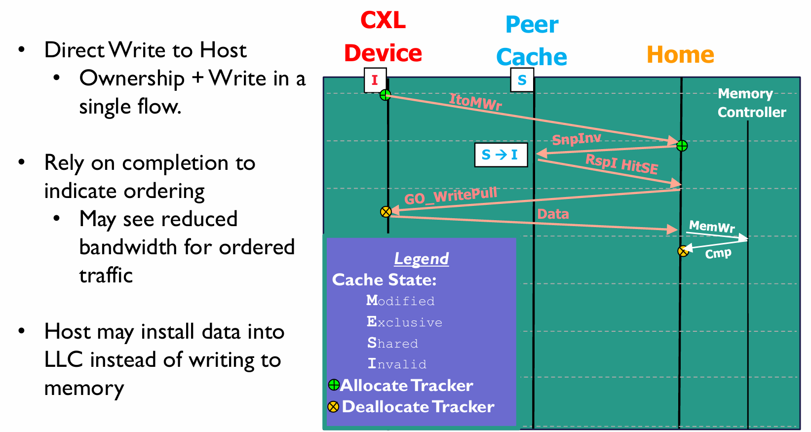
- CXL设备发送ItoMWr/WrCur给Home Agent；Home Agent需要首先负责获取独占权限，然后才能发送GO_writePull，即表示这个写已经全局可见。CXL 设备在收到Go_writePull后就可以把数据直接发送给Home agent；
- Home Agent接收到要写入的数据后到底是写到Memory还是推送到peer Cache中；取决于实现，以及当前处理的请求类型。比如MemWr只有在缓存命中的时候才会写入到缓存中，否则直接写到内存中。而ItoMWr只要在memory之前有缓存层级，就会写到缓存中，而不会写到内存中去。
### CXL.mem
- CXL.mem使得host可以使用load/store语义访问device上的内存
- CXL.mem 将附着设备的内存纳入一致性系统地址空间，通过共享的全局地址映射实现设备内存与主机内存的统一可见性。这种内存被称为 主机管理设备内存（Host-Managed Device Memory, HDM），并具有 设备管理一致性（Device Managed Coherence, DMC）。
    - 与PDM（Private Device Memory）的区分：
        - HDM：纳入全局一致性域，主机可直接访问（如CXL设备内存）。
        - PDM：仅设备内部可见，主机无法直接访问（如传统GPGPU的GDDR）。它完全由设备硬件和驱动程序管理，主要用作具有大型数据集的设备的中间存储。当接收操作数并写回结果时，它涉及从 Host 内存到附着设备的内存之间的大量来回复制。
        - CXL设备可同时包含HDM和PDM区域。

CXL.mem共有三种一致性模型，分别是**HDM-H**、**HDM-D**和**HDM-DB**

- **HDM-H**：仅Type3设备，也就是无CXL.cache，主要作用是用来内存扩展，不存在会修改设备内存中的计算单元，因此设备不会缓存host的内存。

- **HDM-D**：仅Type-2设备，使用CXL.cache维护跟主机的一致性；
    - 为了简化HDM-D设备一致性协议的实现，CXL提出了一种称为**基于偏置的连贯性模型**(Bias Based Coherency Model)。HDM-D设备内存分为两种偏置模型，一种为**主机偏置**(host Bias)，一种为**设备偏置**(Device Bias)；
        - Host Bias：
            - 主机可直接低延迟访问设备内存（类似远端本地内存），加速任务卸载与结果拉取。
            - 设备访问需通过CXL.cache协议向主机请求，确保缓存一致性（如Type 2设备）。
        - Device Bias：
            - 设备可高带宽访问本地内存，无需与主机交互（无窥探开销），因主机保证无缓存副本。
            - 主机访问需先触发偏置翻转（Bias Flip）（通过缓存冲刷与状态切换），确保一致性后再访问。
        - CXL设备也可以不实现偏置模式，那么认为所有的内存都是Host Bias

- **HDM-DB**：在CXL3.0后，新增加的一致性模型，可以用于type2/type3设备

### 协议通道和消息类型
在 CXL.cache 中，两端是 Host 和 Device；而 CXL.mem，两端是 **Master**和**Subordinate**。

从 Master 到 Subordinate 的消息（M2S）有三类：

1. Request(Req)
    
2. Request with Data(RwD)
    
3. Back-Invalidation Response(BIRsp)
    

从 Subordinate 到 Master 的消息（S2M）有三类：

1. Response without data(NDR, No Data Response)
    
2. Response with Data(DRS, Data Response)
    
3. Back-Invalidation Snoop(BiSnp)

<!-- 实现CXL.mem的设备可以选择是否为内存空间的每个缓存行存储Meta信息：
 - 无Meta存储：设备依赖主机动态下发一致性指令（metaValue + SnpType），节省硬件开销，适合简单设备。
 - 有Meta存储：设备利用本地Meta信息加速一致性决策（如快速判断缓存行状态），适合高性能复杂设备。

- I 表示Host侧不存在这个地址数据的副本，可以直接从memory中提供数据。
- A 表示Host侧有这个地址数据的副本，并且可能后续会进行更新。那么DCOH在后续服务请求时需要先通过CXL.cache协议向Host发送请求解决一致性问题。
- S 表示Host侧有这个地址数据的副本，但是不会进行更新。那么DCOH是可以安全地从memory中提供数据的，但是如果CXL设备想要获取独占权限，还是需要向Host发送请求的。 -->

### HDM-H
在Type 3设备中，HDM-H地址区域用作内存扩展器或用于具有软件一致性的共享FAM设备，其中设备不需要主动管理与主机的一致性。
此，访问HDM-H时不使用DCOH代理。这使得流向HDM-H的事务流可以简化为仅两类，即读取和写入。
#### Read from Host
在此流程中，仅返回一条数据消息。
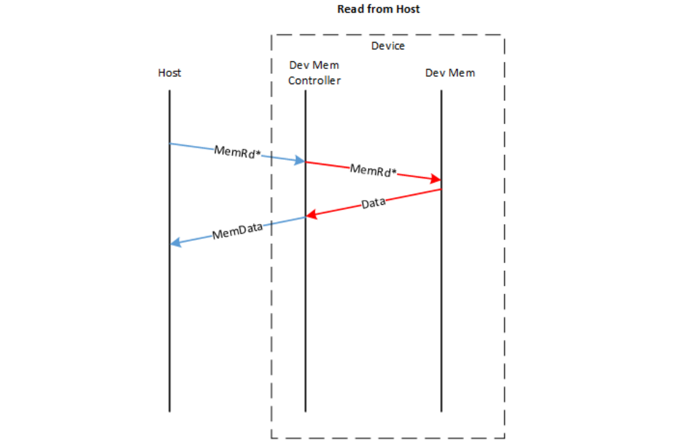

#### Write from Host
与读取操作不同，写操作总是以S2M NDR Cmp消息完成。这一通用的写入流程下图：
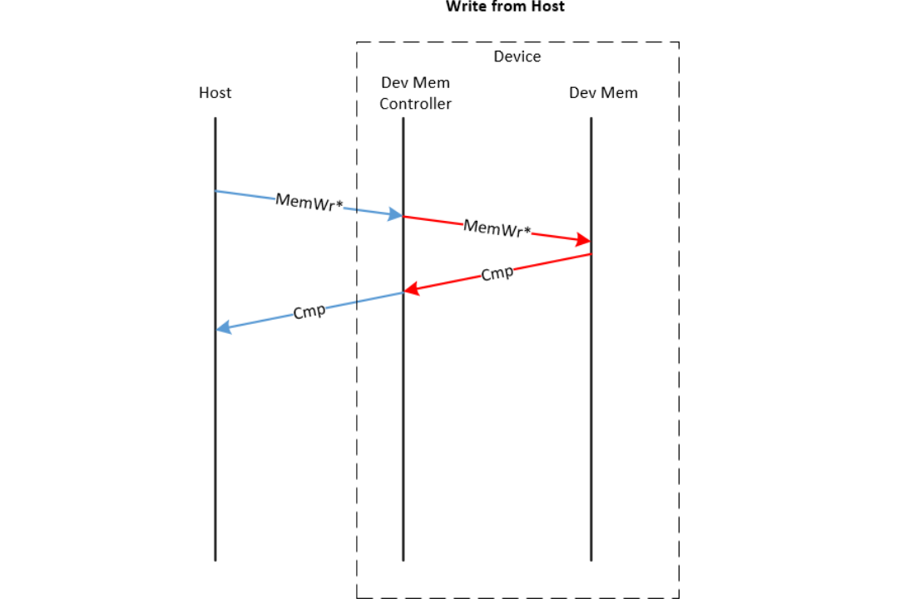

### HDM-D
#### Read from Host
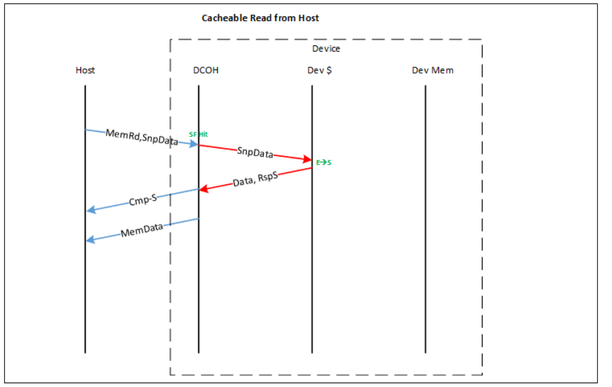
其中Dev$表示设备内的缓存，Dev Mem表示附着设备的内存；
Host从M2S方向的Req通道发送MemRd请求，同时包含SnpData，表示Host仅仅想要一个副本，后续不打算修改。DCOH则查找Snoop Filter发现命中，则嗅探自己的缓存。
嗅探缓存得到数据后通过S2M的NDR通道响应Cmp-S（Host的缓存只能处于S状态），通过S2M的DRS通道响应MemData

#### Write from Host
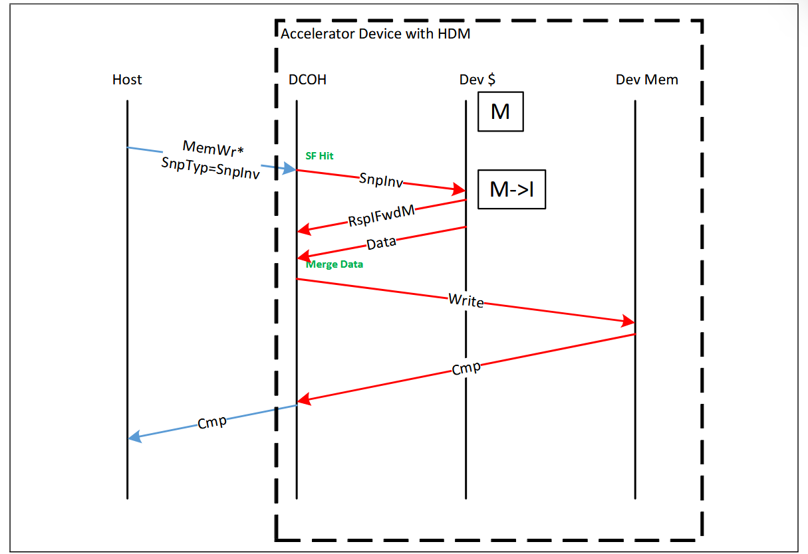
Host在H2S的RwD通道发送MemWr/MemWrPtl请求，写的数据一并通过这个通道带下来。
DCOH查找SF，嗅探数据的同时将所有设备端的副本无效掉；
获得嗅探的原始数据后跟需要写入的数据进行合并，然后一起写到设备内存中；
最后给host在S2H的NDR通道响应一个Cmp表示写入完成；

#### Device Read to Device Memory
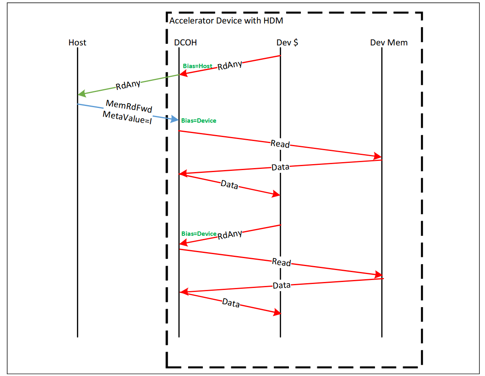
如果DCOH确认这个地址处于主机偏置，需要通过CXL.cache发送请求到主机侧来解决缓存一致性（我们知道Type2设备是支持CXL.cache，而处于主机偏执下的设备内存此时对于设备来说就相当于主机内存，所以可以复用CXL.cache协议）。
如果DCOH确认这个地址处于设备偏置，如上图的下半部分，那么直接从本地内存读数据即可。
当主机侧处理完读请求的一致性后，在这个例子中主机没有修改过的数据（可能是S/E状态），因此它在CXL.mem的M2S Req通道上发送MemRdFwd请求，并携带MetaValue来表示Host端是否还有副本。请注意Host发送的MemRdFwd请求相当于是对设备在CXL.cache D2H Request通道RdAng请求的响应(回顾上面，本来是在CXL.cache 的H2D 响应通道发送Go响应的)，这么做目的是确保后续Host对附着设备内存在CXL.mem M2S通道上发送的请求能够被序列化到该请求的后面，减少了可能的冲突冒险发生。
DCOH在接收到MemRdFwd就代表设备内存中的数据就是最新的。在上面的例子中，Host侧没有修改的数据，所以可以直接发送MemRdFwd请求当作响应；后续的操作就比较简单了，类似于设备偏置的情况。

#### 设备发起的写操作
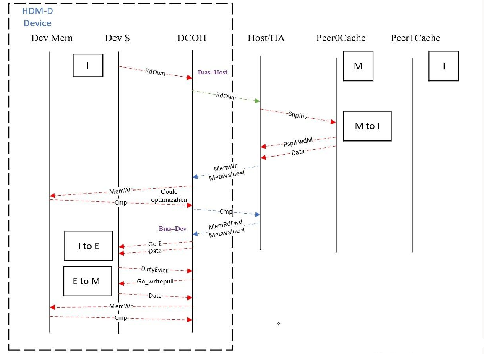
上面的过程其实跟普通的读操作是类似的，只不过发送的请求变成了RdOwn，同时在主机侧所进行的Snoop操作变成了SnpInv，最后返回给DOCH的Metavalue也变成了I。其他的过程都是一样的。主机收到MemRdFwd的响应后会变成设备偏置模式。在设备偏置模式下，设备缓存的写回操作不需要经过Host了，在设备端即可完成，具体实现可以参考CXL.cache协议；
如果设备本地端还有其他缓存存在副本，DCOH除了发送请求给Host解决外部的一致性外，还需要负责发送SnpInv去无效设备本地端的缓存副本。在上面例子中由于Host中缓存处于M状态，在设备本地的其他缓存不可能存在副本。

## CXL2.0
CXL2.0增加了单层交换、资源池化、持久化、QoS保障、热插拔的特性。
### 池化
CXL2.0增加了单层交换，host和device直接可以通过一个CXL Switch互连起来。

为了支持多主机连接和设备池化，每个主机都表示CXL topology作为一个虚拟层次（VH），包括交换机和机的端口以及每个具有设备资源的端口的Virtual Bridge一个物理CXL交换机在内部虚拟成多个虚拟CXL交换机(VCS，Virtual CXL Switch)。连接上CXL交换机的每个主机可以看到一个独立的VCS，VCS由Virtual Bridge组成，通过树状拓扑结构连接到所挂载的CXL设备上。
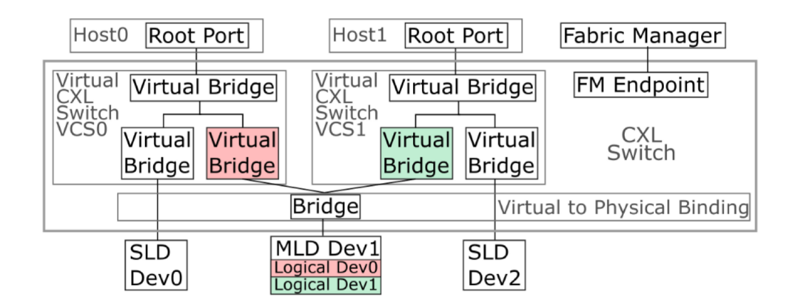

CXL2.0支持两种池化形式，分别是SLD(Single Logical Devices)和MLD(Multiple Logical Devices)
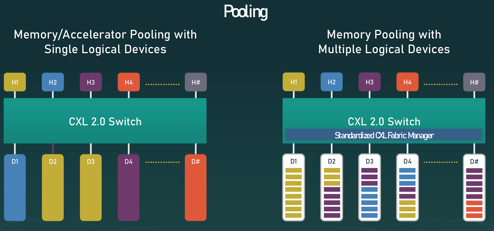

FM（Fabric Manager）动态配置主机VCS中虚拟桥跟特定设备之间的连接。在实践中，FM 可以是在主机上运行的软件、 或 CXL 交换机中的固件，或者是一颗在arm芯片。。FM可以控制每个VCS跟哪些设备进行绑定/解绑，因此也就完成了资源池化(通过MLD特性，将资源细粒度按需分配给需要的VCS；对SLD的重新绑定完成资源的重新分配)的功能。

对于MLD，允许将单个 CXL.mem(CXL2.0)设备的资源划分为最多 16 个逻辑设备，这些逻辑设备可以同时分配给不同的主机。CXL2.0池化功能兼容CXL1.0/1.1，但是CXL1.0/1.1设备只能进行SLD形式池化。

## QoS
由于交换、MLD 以及可能的不同类型的内存（可能不基于 DRAM）资源在单个交换机中可能变得过载，从而导致 QoS 问题。例如，一个设备的低性能可能导致使用交换机的所有代理的拥塞。为了缓解这个问题，CXL 2.0 在 CXL.mem 响应消息中引入了 DevLoad 字段，以通知主机其访问的设备中观察到的负载。主机应使用此负载信息来减少向该设备发送 CXL 请求的速率。

## CXL3.0
CXL3.0引入/拓展了以下功能：
1. Fabric capabilities and fabric attached memory
2. Enhance fabric management framework
3. Memory pooling and sharing
4. Peer-to-peer memory access
5. Multi-level switching 
6. Near memory processing
7. Multi-headed devices
8. Multiple Type 1/Type 2 devices per root port 
9. Supports PCIe® 6.0 

### 双倍带宽
每引脚带宽翻倍，同时保持延迟不变
CXL3.0采用PCIe 6.0® PHY @ 64 GT/s，采用256B Flit
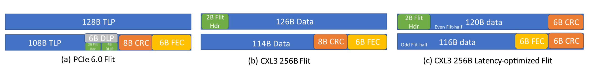
- **Flit 模式**：
    
    - **256 字节**：高速模式下整合数据 + **Reed-Solomon FEC** 纠错，带宽优先。
        
    - **LO 模式**：分拆为两半（128 字节），前半含头部 + **精简 CRC**，支持提前处理，**降低延迟 2ns**。
        
    - **68 字节**：兼容旧设备，低速率强制支持。

### 多级交换互连
在CXL2.0中，Host到Device之间只能由一个CXL Switch（单层交换），而在CXL3.0中可以支持多级交换。
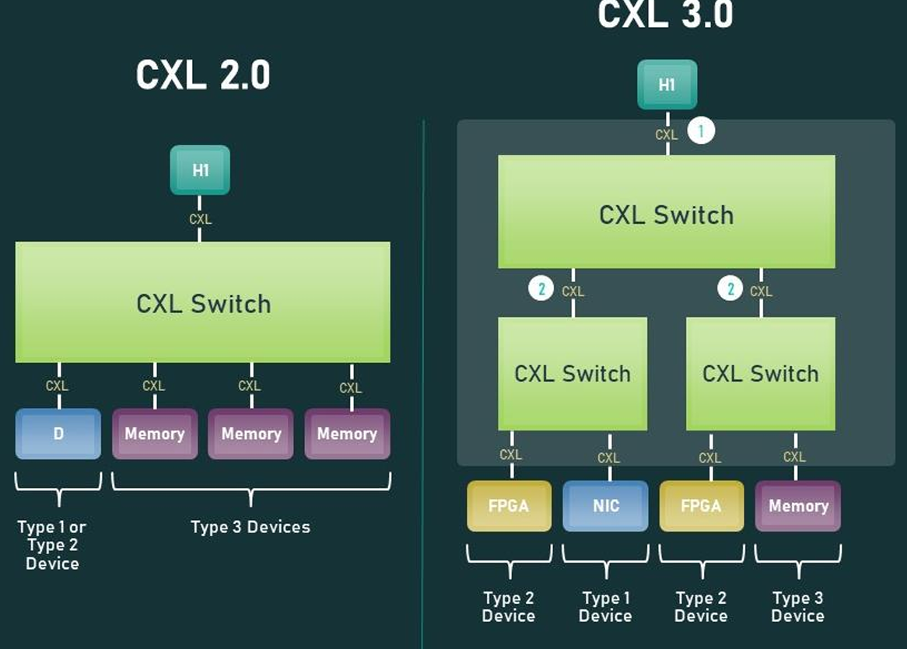
在CXL2.0中，Host想要连接多种设备，只能通过root port连接CXL Switch进行连接多种设备；而在CXL3.0中，使得单个主机端口可以同时挂载多种设备，并且设备数目也可以更多（最多16个CXL.cache设备）。

### 内存池化与内存共享
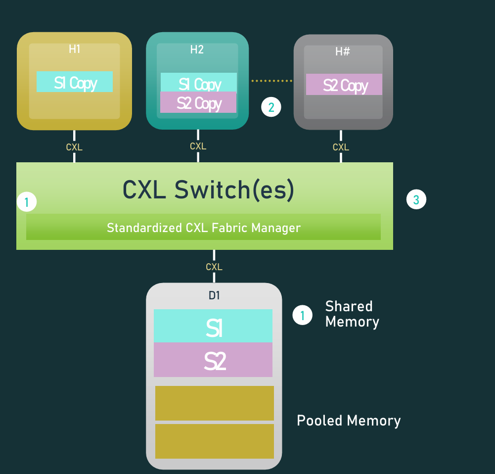
CXL3.0支持池化内存共享，device的一块内存区域可以被多个host共享，由于在CXL2.0定义中只有CXL.cache协议可以被用来交换cache一致性信息，但是他的优先级没有M2S的内存读的操作优先级高，因此会被block， 由此在memory sharing的场景中可能会导致读写的数据是失效的。

为了解决共享内存在多host中的一致性（Type2、Type3），CXL3.0在CXL.mem中增加了Back-Invalidation机制，当由一个host对共享内存进行修改时，可以通过Back-Invalidation通知其它host使得对该共享内存对应的cache line进行无效化。
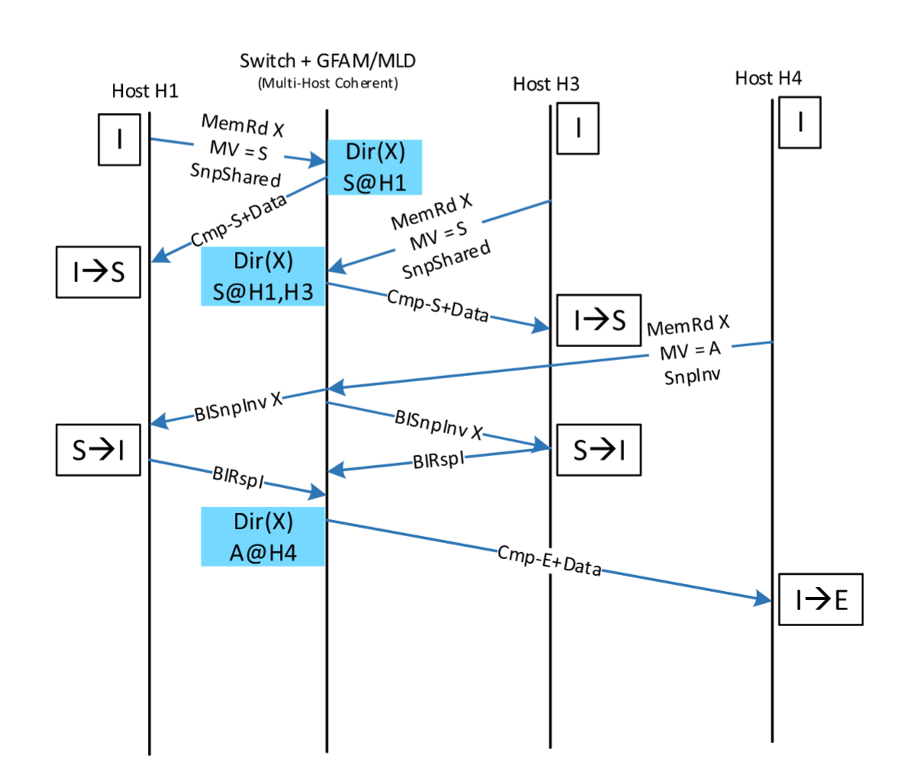
#### Global Fabric Attached Memory (GFAM)
CXL3.0 还引入了全局网络结构的附加内存（Global Fabric Attached Memory，GFAM）的概念，它通过将内存从处理单元中解聚出来，实现了共享大内存池。这种架构允许内存与多个处理器直接连接，或者通过 CXL 交换机进行连接，从而提高了内存的灵活性和利用率。GFAM 架构的一个关键特点是，它允许内存池中的内存可以是相同类型或不同类型。GFAM最多可以支持4095个host使用。

### Multi-Headed Device
​在 CXL 3.0 规范中，多头设备（Multi-Head Device，MH-Device） 是指具有多个 CXL 端口的 Type 3 设备。​每个端口被称为一个“头（Head）”，这些端口允许设备与多个主机或交换机进行连接，以实现更高的带宽、冗余性和灵活的拓扑结构。

在 CXL 3.0 规范中，**多头设备（Multi-Head Device，MH-Device）** 是指具有多个 CXL 端口的 Type 3 设备。每个端口被称为一个“头（Head）”，这些端口允许设备与多个主机或交换机进行连接，以实现更高的带宽、冗余性和灵活的拓扑结构。

**多头设备的类型**：

1. **MH-SLD（Multi-Head Single Logical Device）**：那么每个CXL端口(头)上呈现的都是SLD（虽然也是在内部进行了MLD的逻辑设备划分）

2. **MH-MLD（Multi-Head Multiple Logical Device）**：：在任意CXL端口上都可能呈现的是MLD。

需要经过两层解码，首先是CXL端口到逻辑设备的映射。每个逻辑设备的资源管理按照MLD来。

逻辑设备在内存资源，状态，上下文，管理上都是隔离的；
每个逻辑设备一次只能映射给一个头，但是一个头可以被多个虚拟层次连接，实现内存共享。
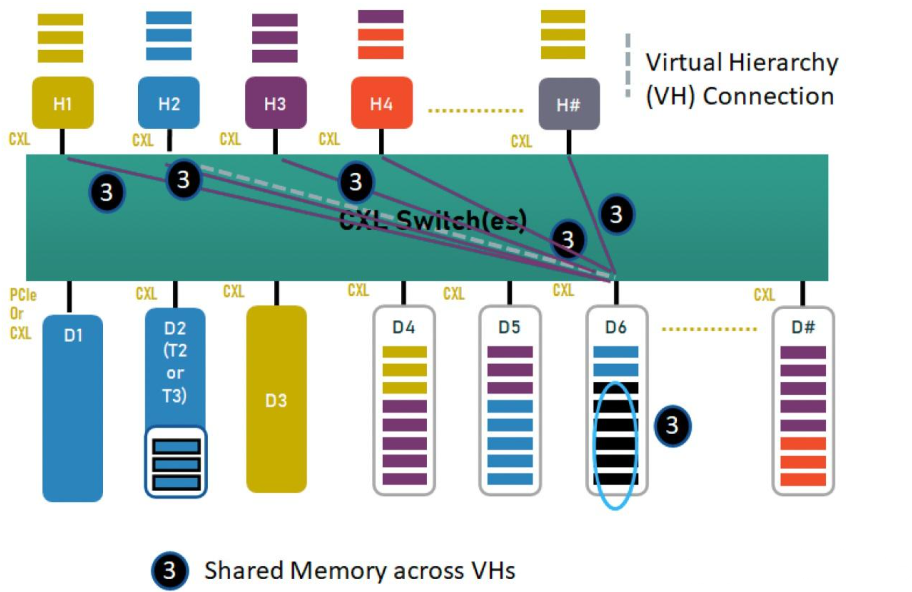

### Fabrics
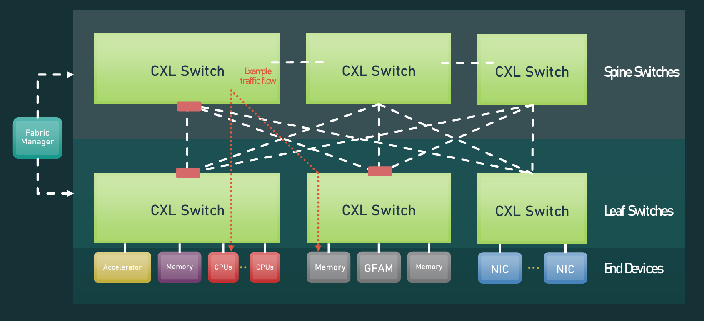
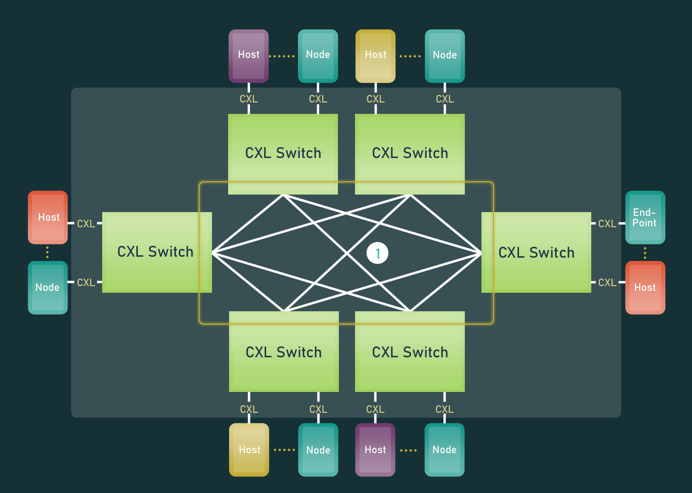
CXL3.0中引入了多级交换，并且突破了树状结构，成为一个网状的Fabrics，并且不再严格区分host和device，每个Node都可以是host或者device。
### Device peer-to-peer communication (P2P)
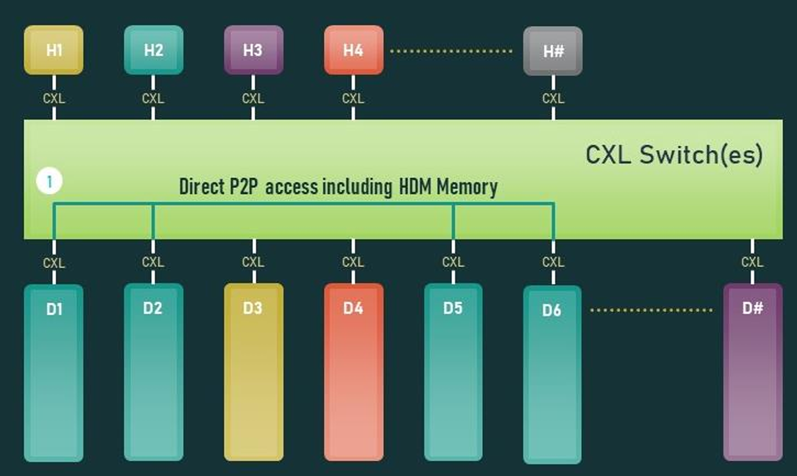
CXL 3.0通过back-invalidate来支持内存共享，同时结合UIO实现不经过Host的点到点的通信

无序IO（Unordered I/O ）提出的背景：是PCIe上运行的软件依赖于消费者-生产者排序模型（producer-consumer ordering model），这个排序模型针对是整个系统，不管事务访问的设备是否相同，不管访问的地址位置是否相同，不管访问的属性是否相同（比如可缓存和不可缓存）。消费者和生产者排序模型如下图(a)所示，编程模型保证生产者将数据写到一个内存位置后，后续再写入一个flag，那么系统中所有可能的消费者只要读到了这个flag就一定可以看到生产者写入的数据。在原始的PCIe系统中遵循者树状拓扑结构（层次化路由，Hierarchy Based Routing，HBR，如图42左边），设备跟设备之间只存在唯一的路径，进行保序比较容易实现。但是CXL3.0为了扩展到更多的设备高带宽低延迟互联，提出多层交换机架构和基于端口的路由（Port-Based Routing，PBR，如图42右边），打破了原有树状结构，使得节点到节点的路径不止一条。这时为了避免在路由中引入过多的保序复杂度，同时维护消费者和生产者排序模型，就引入了UIO。UIO的写操作不管是posted还是non-posted的属性，一律当作non-posted来对待，non-posted写规定必须接收到完成事务（Completion）后才能继续后面的写入，因此排序的强制要求放在了发起事务的源头来做。
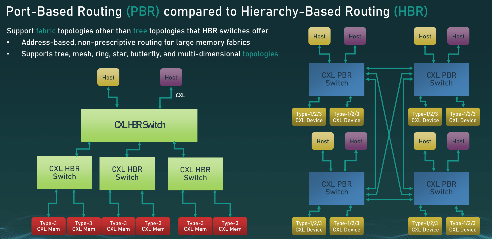
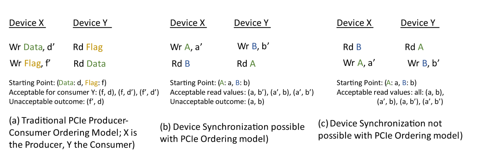

#### 2. 引入虚拟通道（VC）与“无序”事务

- **虚拟通道（VC）机制**  
  CXL 3.0（继承自 PCIe）通过引入多个独立的虚拟通道（VCs）来实现“无序”读/写及完成事务。每个 VC 内部通过三种流控（FC）类别管理：
  - **Posted (P)**：处理如 Memory Write 的事务。  
  - **Non-Posted (NP)**：处理如 Memory Read 的事务。  
  - **Completion (C)**：为 NP 事务提供完成响应。
  
- **无序事务的实现**  
  在这种机制下，虽然每个 VC 内部不保证事务的全局顺序，但生产者端（例如某设备）通过对同一 VC 内的事务顺序进行控制，实现了 producer-consumer 模型的顺序语义。  
  - 例如，每个 UIO Write（用户 I/O 写）必须等待其完成响应（UIO Write Completion），才能向下发出后续的“标志”信号，表明数据已就绪。

- **UIO（Unordered I/O）机制**  
  UIO Write 和 UIO Read 分别对应于 P 类和 NP 类的事务，UIO Completion 则在 C 类中处理。这样设计的目的是：  
  - 在不依赖主机 CPU 中转的前提下，实现设备间直接通信，同时保持生产者与消费者之间的必要顺序。

#### 3. Back-Invalidate（BI）机制及其作用
  
  1. **直接设备间通信**：  
     - 借助 UIO 和 BI 流，设备可以直接访问 HDM-DB（Host-managed Device Memory Device-coherent with Back-invalidate support）内存，而无需经过主机 CPU 的处理，从而降低延迟和减少主机负担。  
     - 当设备对内存发起读写时，若缓存行状态不符合直接访问要求，则内存控制器通过 BI 流通知主机进行必要的缓存失效处理。
  

### 4. 点对点通信实现的关键总结

- **多路径传输**  
  通过虚拟通道的无序事务机制，使得 CXL.io（以及继承的 PCIe 事务）能够在非树形、具有多条路径的拓扑中传输，而不会破坏生产者与消费者之间的顺序要求。

- **独立控制与局部顺序**  
  每个 VC 内部的事务顺序由发送端（生产者）自己控制，确保了数据传输的正确顺序，而不同 VC 之间则相互独立，可以在多个路径上并行传输。

- **直接设备间数据交换**  
  结合 BI 流，CXL 3.0 实现了设备可以直接访问和管理 HDM-DB 内存，既支持设备直接点对点通信，也能支持大规模、共享一致性内存的应用场景。

## CXL3.1 & CXL3.2
CXL 3.1和CXL 3.2在CXL 3.0的基础上进一步扩展了功能，主要新增特性如下：

### **CXL 3.1 新增特性**
1. **更大规模的Fabric架构支持**
   - **端口路由（Port-based Routing）**：通过基于端口的路由机制，支持更复杂的网络拓扑，提升可扩展性。
   - **Fabric附加设备**：允许设备直接连接到Fabric网络，突破传统单层交换架构限制，适用于“机架规模”（Rack Scale）场景。

2. **增强的点对点通信（P2P）**
   - 支持通过**CXL.mem协议**实现设备间的直接内存访问，减少主机干预，提升通信效率。

3. **可信安全协议（TSP）扩展**
   - **覆盖加速器设备**：TSP从仅支持内存设备扩展到加速器设备，提供端到端加密和可信执行环境（TEE），保障敏感工作负载的安全。

4. **管理功能增强**
   - **Fabric管理API**：标准化接口，简化对交换机和设备的集中管理，支持动态资源分配。

### **CXL 3.2 新增特性**
1. **热页监控单元（CHMU）**
   - **硬件级内存分层优化**：通过CXL内存设备内置的CHMU，实时跟踪“热页”（频繁访问的内存页），减少软件开销。
   - **灵活配置**：支持多粒度（如256MB地址范围）监控，阈值和周期可配置，提升内存利用率。
   - **标准化接口**：通过“热列表”（Hotlist）向软件报告热页，避免厂商绑定。

2. **可靠性、可用性与可维护性（RAS）增强**
   - **硬件级修复（hPPR）**：支持硬件自动修复内存设备的物理损坏（Post Package Repair），减少停机时间。
   - **事件记录优化**：新增事件记录字段（如Head ID/LD ID），实现更精准的错误定位和隔离。

3. **性能监控与元数据管理**
   - **性能计数器**：提供CXL内存设备的访问统计，帮助优化应用性能。
   - **元数据存储**：允许主机管理HDM-H地址区域的元数据（如ECC、安全标签），动态调整DRAM使用。

4. **安全与兼容性改进**
   - **IDE扩展**：对延迟毒药消息（Late Poison Messages）提供完整性与加密保护。
   - **PCIe MMPT兼容**：支持PCIe管理消息透传，统一CXL/PCIe设备的管理框架。

5. **合规性测试**
   - 新增TSP合规性测试，确保不同厂商设备的互操作性。

### **总结**
- **CXL 3.1**：聚焦**大规模Fabric扩展**和**安全增强**，支持复杂拓扑和加速器安全。
- **CXL 3.2**：优化**内存管理效率**（CHMU）、**可靠性**（hPPR）及**运维能力**（性能监控、元数据），并强化与PCIe生态的兼容性。

这些特性进一步巩固了CXL在异构计算、内存池化和AI工作负载中的核心地位。

