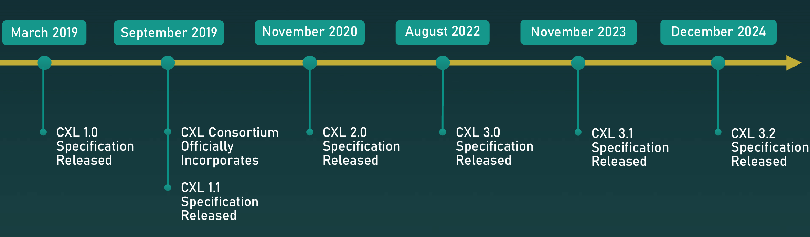

# CXL初认识
## CXL诞生的背景
随着人工智能大模型（如670B参数的deepseek）、高性能计算、云原生应用的快速发展，传统计算架构面临根本性瓶颈。CPU与GPU、FPGA等异构加速器之间的协作效率低下，内存带宽增速远落后于算力需求，数据中心资源利用率不足等问题日益突出。在此背景下，CXL(Compute Express Link)于2019年由英特尔牵头推出，旨在通过统一缓存一致性协议和硬件解耦技术，重构计算、内存、存储的协作方式。随着云计算、人工智能、大数据分析、高性能计算需求的出现，计算需求和数据处理器的复杂性在不断增长，随之而来的是巨大的算力和存储需求。
### 当前计算和存储架构的三大挑战
1. **内存墙问题**
    - 算力与存储资源的不平衡：CPU算力提升远超DRAM带宽提升，导致CPU大量算力浪费在数据等待。
    - 扩展天花板：
        - DDR5单通道50GB/s需200引脚，PCIe 5.0同等引脚实现256GB/s
        - 3D堆叠DRAM成本达传统方案3倍，2DPC方案带宽提升不足20%
    - 容量瓶颈：DRAM密度提升受限于散热能力，单芯片容量增速降至年10%。
2. **数据中心资源搁浅**
    - 数据中心为了处理峰值的工作负载需求，每台服务器都配置了过量的内存和加速器，这导致数据中心的总体拥有成本(TCO)中内存占比逐年上升。由于资源的紧密耦合(其中计算、内存和 I/O 设备仅属于一台服务器)，导致在空闲时段，大量资源被闲置。
        - 阿里云实测显示，AI推理集群在非高峰时段内存闲置率高达45%，而突发任务又因局部资源不足排队。
        - Microsoft Azura数据中心的实测数据显示有超过25%的内存出现搁浅。
3. **异构设备间的一致性通信问题**
    - 协议碎片化：NVIDIA NVLink、AMD Infinity Fabric等私有协议互不兼容，跨厂商设备协作需依赖低效的软件模拟一致性。
    - 缓存同步开销：传统PCIe缺乏硬件级缓存一致性，GPU与CPU通信需手动刷新缓存，增加20%-40%的软件复杂度（如PyTorch框架中的显式同步操作）。

### CXL的应对策略
针对上述挑战，CXL通过三大核心技术实现突破：

- **缓存一致性协议（CXL.cache）**：允许CPU与加速器共享缓存，消除冗余数据拷贝（如AI训练中梯度数据可直接同步）。

- **内存池化（CXL.mem）**：将DRAM/NVM组成共享资源池，支持TB级内存动态分配（如云计算中按需调配内存资源）。

- **协议兼容性（CXL.io）**：基于PCIe物理层实现跨厂商设备互连，打破生态壁垒（如英特尔CPU与AMD GPU直接通信）。

### CXL发展历程
CXL（Compute Express Link）协议自其诞生以来，经历了快速的发展和演进，旨在解决现代计算系统中内存和计算资源的紧耦合问题，实现更灵活的内存扩展和高效的异构计算支持。英特尔利用二十多年来开发 PCI-Express 的经验，在2019年3月里程碑式地开源了CXL 1.0规范，主要支持三种协议——CXL.io、CXL.mem和CXL.cache，分别用于传统I/O操作、内存访问扩展和缓存一致性，已经具备了主机和CXL设备点对点一致性连接的完整协议链路。

- 在2019年9月英特尔与阿里巴巴、思科、戴尔、谷歌、华为、Meta、Microsoft 和 HPE 成立了 CXL 联盟，并推出了CXL1.1，主要增加了合规性测试机制。
- 2020年11月，CXL 2.0规范发布，引入单级交换机和多逻辑设备概念，支持内存池化 (Memory Pooling) ，新增链路级完整性和数据加密(IDE，link-level integrity and Data Encryption)；
- 2022年8月，CXL 3.0规范发布，扩展到多层交换结构、物理链路升级到PCIe 6.0、支持内存共享（Memory Sharing）。
- 2023年11月 CXL 3.1规范发布，进一步扩展了交换结构、增强内存功能，新增基于安全执行环境的安全协议。
- 2024年12月 CXL 3.2规范发布，聚焦于内存效率、安全性和互操作性。 
<!--  -->

## CXL三种设备
CXL一共拥有三类设备：

- **Type1 device**：依赖host的memory
    - 需要一个完全一致的缓存来访问宿主的内存。
    - 支持使用CXL缓存链路层的设备：设备可以缓存宿主的内存。
    - 可以在其上实现任何内存一致性模型。
    - 特殊功能：支持无限数量的原子操作。
- **Type2 device**：local memory + host memory

    - 支持所有三种协议：CXL.io、CXL.cache和CXL.mem
    - 设备额外拥有内存（如DDR、HBM等）
    - 设备具备缓存 + 内存（设备管理的一致性）
    - 设备内存可以是私有的，也可以与宿主共享
- **Type3 device**:
    - 支持CXL.io和CXL.mem协议
    - 不操作宿主内存
    - 作为内存扩展器使用
    - 没有计算单元
    - 它不参与缓存一致性，而是处理来自宿主发送的请求

## CXL子协议
CXL协议由三个协议组成，分别是**CXL.io**、**CXL.cache**和**CXL.mem**协议。其中CXL.io功能**等同于PCIe**，在电气层和物理层上复用PCIe接口。**CXL.cache协议允许device缓存host的内存**，实现host和device之间的缓存一致性。**CXL.mem允许host以load/store语义**去访问device的内存，就像访问host的本地内存。

CXL是一种**非对称的**一致性协议，在Host中集成一个home agent，由**host统一管理**所有device的缓存一致性，而非device与device之间直接协调，device中仅仅需要实现一个简单的MESI协议。

<!-- 为了最快的说明CXL，先从CXL 1.1开始讲起。 -->

PCIe使用分层协议，分别是物理层、数据链路层和事务层。CXL在PCIe物理层上多路复用其三种协议。每个协议的传输单元为 Flit（流控制单元）。

其中CXL.io复用了数据链路层和事务层。而CXL.cache和CXL.mem分别实现了自己的数据链路层和事务层。

CXL1.0、1.1、2.0定义了68Byte-Flit，CXL3.0定义了256Byte-Filt。
