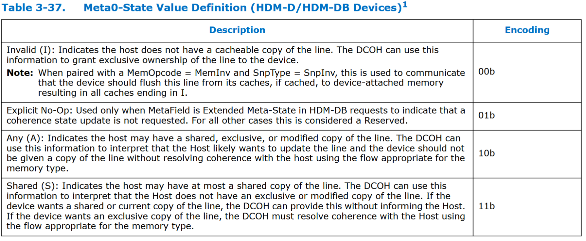

# CXL子协议
## CXL.io
- **继承性**：CXL.io 直接基于 PCIe 5.0 的物理层和链路层，兼容其电气特性与基础协议栈。
    
- **扩展功能**：在 PCIe 基础上，CXL.io 增加了对 CXL 设备（如加速器、内存扩展卡）的发现、配置和高效 I/O 虚拟化的支持。
    
- **定位**：CXL.io 是 CXL 协议的“基础层”，与 CXL.cache（缓存一致性）和 CXL.mem（内存访问）共同构成完整的 CXL 协议栈

## CXL.cache
- CXL.cache允许**device缓存host的主存**，并且规定CXL device中的cache使用**MESI**协议来维护cache coherent
- CXL.cache实现的是**非对称一致性协议(目录协议)**，host中集成一个home agent，由host统一管理所有device的缓存一致性。所以CXL设备不需要直接与任何同级缓存交互，而只需要跟Home Agent交互。其中Home Agent通过发送Snoop请求给同级缓存进行一致性的维护，为了减少不必要的一致性流量，Home Agent会实现一个叫Snoop Filter的结构。
- CXL.cache所有请求地址都是host的**物理地址**，在CXL设备中可以实现一个DTLB来加快地址翻译过程，DTLB的表项可以通过PCIe提供的地址翻译服务（ATS）向主机进行请求。
- CXL.cache传输的**数据粒度始终为64B**

CXL.cache是一个双向cache一致性协议，分为两个方向：**D2H，H2D**。每个方向上又有三个通道：**Request、Response以及Data**。

        
### D2H request
D2H Request一共有15条commands，可以分为4类：**Read、Read0、Read0-Write以及Write。**
- **Read：进行读操作，需要最新的数据**
    - RdCurr：获取数据后不缓存。
    - RdOwn：读数据同时获取独占的权限
    - RdShared：只是读数据，不获取独占权限
    - RdAny：获取数据后可以是任何状态，默认是缓存的

- **Read0：发送读请求但是不需要数据，仅仅请求获得cache line一致性状态**
    - RdOwnNoData：已经有数据，但是需要获取独占的权限
    - CLFlush：无效同级的缓存行，如果是脏数据在无效前先写回
    - CacheFlushed：表示一种确认，自己缓存行已经完成冲刷，用于帮助Home Agent更新Snoop Filter
- **Read0-Write：允许Device在发出请求之前无需任何一致性状态，即可直接向Host写入数据（原子性操作，先获取独占权限（Read0）再写入数据（Write），合并为单次请求。**）。
    - ItoMWr：Home Agent收到请求后首先获取写权限，不需要传递最新的数据给CXL Device，因为接着CXL设备会对整个缓存行进行写入，写完后CXL设备还是处于I状态
    - WrCur(CXL3.0更名)/MemWr(旧名字)：跟ItoMWr一样，CXL设备只负责提供写入的数据，不会缓存数据。跟ItoMWr不一样的地方是CXL提供的数据写入的位置。MemWr只有在缓存命中的时候才会写入到缓存中，否则直接写到内存中。而ItoMWr只要在memory之前有缓存层级，不管是否命中，都会写到缓存中，而不会写到内存中去。

- **Write：将数据写回Host，同时将Device中对应的cache line状态设置为I**。
    - CleanEvict和DirtyEvict都是将自己的数据写到Host中，自己无效掉；
    - CleanEvictNoData：不会向host发送数据，只需要通知Host自己静默驱逐啦，让Host修改snoop Filter的表项。
    - WOWrInv: weakly order 部分写，它的响应是FastGO（Global Observation），不提供GO语义；（Home Agent收到WOWrInv请求后，不用等维护一致性所有的Snoop请求全部收到响应，就可以发送FastGo+WritePull组合响应给CXL设备侧，即这个时候并不保证写全局可见，但是可以更快地完成写请求。如果需要全局可见，需要等到最后收到了ExtCmp消息）
    - WOWrInvF：weakly order 整个缓存行写入
    - WrInv：strong order 写(不区分是否整行写入，最后还会收到Go_I表示全局可见)

### H2D request
**H2D 请求通道用于主机更改设备中的缓存一致性状态**，这被称为“**Snooping”（缩写为 Snp）**。设备必须根据 Snoop 类型更新其缓存，并且在缓存中有脏数据（M 状态）的情况下，还必须将数据返回给主机。
H2D Request消息由三种：**SnpData、SnpInv、SnpData**

- SnpData
  - **缓存状态降级为共享状态，但必须返回任何修改的数据**
  - 这些是来自主机的对要缓存的行的 snoop 请求, 这些缓存行打算在请求者是 Shared 或 Exclusive 状态（Exclusive 状态可以缓存在仅当所有设备都以 RspI 响应时的请求者）。 这种类型的 snoop 通常是由数据读取请求触发。 接收此侦听的设备必须要么使所有缓存行无效或降级为共享状态。 如果设备持有脏数据必须归还给Host
- SnpInv
  - **缓存行降级为无效，必须返回任何修改的数据**
  - 这些是来自主机的对打算授予所有权的缓存行的 snoop 请求，缓存行在请求者中是独占状态。专门为Write类请求服务，获取缓存行独占权限。接收此监听的设备必须使所有高速缓存行无效。 如果设备持有脏数据，它必须将其返回给主机。
- SnpCur
  - **缓存状态不变，必须返回任何修改的数据**
  - 这个 snoop 获取缓存行的当前版本，但不需要更改任何缓存层次结构中的状态。它仅为了 RdCurr 请求发送。如果设备保存处于修改状态的数据，它必须将其返回给主机。 缓存状态可以保持设备和主机都没有变化，主机不应该更新它的缓存。

### H2D response
-  WritePull
   -  **WritePull 专门为WrInv/WrCur设计的，让CXL设备提供需要写入的数据，当前的请求交易还没有结束；Host接收数据写入后再发送Go-I表示事务完成，全局可见。**
-  GO
   -  **全局观察（GO）消息表明读请求是连贯的，写请求是连贯且一致的。Go表示读或者写请求已经全局可见；并且可以携带MESI的状态，即CXL设备的缓存应该处于的状态。**
 
- GO_WritePull
    - **这是一个组合的 GO + WritePull 消息。 不携带MESI状态消息；主要用于不需要后续再发送一个Go消息来确认写入的数据已经全局可见的写请求。（比如CleanEvict或者DirtyEvict）**
- ExtCmp
   - 这个响应**表明之前本地排序的数据（FastGO）有在整个系统中已经被观察**。 最重要的是，对内存的访问将返回最新的数据。
- GO_WritePull_Drop
   - 此消息与 Go_WritePull 具有相同的语义，除了设备应该不向主机发送数据。
- Fast_GO_WritePull
   - 类似于GO_WritePull，但仅表示该请求在本地被观察到。当事务在内存中完全可观察时，稍后会发送ExtCmp消息。未实现Fast_GO功能的设备可以忽略GO消息并等待ExtCMP。对于WritePull，必须始终发送数据。不会将缓存状态传输到设备。  
   - 在本上下文中，“本地观察”是指特定于主机的相干域，它可能是全局相干域的子集。例如，请求设备与其他CXL.cache设备共享的末级缓存（Last Level Cache），这些设备连接在主机桥下方。在该示例中，本地观察仅在末级缓存内进行，而不是在其他末级缓存之间。
- GO_ERR_WritePull
   - 跟GO_WritePull拥有类似的语义，代表事务出现了错误，CXL设备还是需要提供数据，但是主机会丢弃这个数据

### D2H response
device在收到Host发来的H2D Request后，进行应答，发送D2H Response。
D2H Response消息共有七种，D2H Response 的 Opcode 的名字格式很有规律，**Rsp+X+Hit/Fwd+Y**，X 表示新的缓存行状态，Y 是原来的缓存行状态，Hit 不附带数据，Fwd 附带数据
- X、Y可以为V、SE、M、I、其中V代表MESI种MES三种状态。

- RspXHitY ：CXL设备在Y状态下命中，同时响应后处于X状态；
- RspS(I)FwdM ： 表示CXL设备的缓存之前是M状态，后续变成了S/I，并随后会把数据传给Host
- RspVFwdV ：表示CXL设备缓存之前的状态是M/E，后续保存不变，同时会把数据传给Host；

### example
缓存一致性所涉及的内存层次结构：

这里的Peer Cache可以是下面任意一种：
- CXL的邻居设备
- 本CPU中的cache
- 远端CPU中的cache

这里的内存控制器也可以是各种内存：
- 本CPU的传统DDR
- 远端CPU的传统DDR
- 邻居CXL设备上的CXL.mem

#### Read

- **CXL设备在D2H的Req通道发送RdShare给Home Agent用于读数据**。Home Agent一般会有snoop filter，记录着哪些peer cache可能有这个数据的副本。**home agent接收到RdShared后一边在H2D的Req通道发送SnpData嗅探请求给有数据的peer cache，一边向内存发送读请求**。
- **peer cache接受到SnpData请求后**，并没有传递数据，而是**在D2H的Resp通道返回了RspSHitSE**，表示自己之前是S或者E状态，现在变成了S状态。即peer cache中没有修改过的数据，从内存中获取的数据就是最新的。
- **Home Agent从Memory获得数据**，以及**所有的嗅探结束后，才能向最初的请求者发送GO响应**。其中，GO消息还附带MESI状态信息，用于指示缓存需要切换到的目标状态。在上面的例子中由于还存起其他的副本，所以返回的是GO-S；
#### Write

- CXL设备首先**发送RdOwn请求来获得写权限**，**Home Agent发送SnpInv给所有有副本的缓存**。如果peer cache**没有脏的数据直接回复RspIHitSE/RspIHitI**；如果**有脏的数据需要返回RspIFwdM**，同时将数据通过D2H Data通道写回去。
- 在这个例子中我们看到Home agent把所有的peer cache无效掉，并没有从缓存中获得数据，所以从memory中返回的数据就是最新的。然后发送Go-E和Data给发起者。
- **CXL设备获得写权限后，进行写入操作，缓存行状态从E变成了M**；
- 后续**这个脏的缓存行**可能由于缓存满了需要**被替换出去**，就需要**发送DirtyEvict的写回请求给Home Agent**；**HomeAgent响应GO_WritePull给CXL设备，表示这个写全局可见了**。HomeAgent收到GO_WritePull后就可以安全地把自己的状态改成I状态，同时将数据给到HomeAgent就算完成了。
#### Read0-Write

- **CXL设备发送ItoMWr/WrCur给Home Agent**；**Home Agent需要首先负责获取独占权限，然后才能发送GO_writePull**，即表示这个写已经全局可见。CXL 设备在收到Go_writePull后就可以把数据直接发送给Home agent；
- **Home Agent接收到要写入的数据后到底是写到Memory还是推送到peer Cache中；取决于实现，以及当前处理的请求类型**。比如MemWr只有在缓存命中的时候才会写入到缓存中，否则直接写到内存中。而ItoMWr只要在memory之前有缓存层级，就会写到缓存中，而不会写到内存中去。
## CXL.mem
- CXL.mem使得host可以使用l**oad/store语义**访问device上的内存
- CXL.mem 将**附着设备的内存纳入一致性系统地址空间，通过共享的全局地址映射实现设备内存与主机内存的统一可见性**。这种内存被称为 **主机管理设备内存（Host-Managed Device Memory, HDM）**，并具有 **设备管理一致性**（Device Managed Coherence, DMC）。
    - 与PDM（Private Device Memory）的区分：
        - HDM：纳入全局一致性域，主机可直接访问（如CXL设备内存）。
        - PDM：仅设备内部可见，主机无法直接访问（如传统GPGPU的GDDR）。它完全由设备硬件和驱动程序管理，主要用作具有大型数据集的设备的中间存储。当接收操作数并写回结果时，它涉及从 Host 内存到附着设备的内存之间的大量来回复制。
        - CXL设备可同时包含HDM和PDM区域。

CXL.mem共有三种一致性模型，分别是**HDM-H**、**HDM-D**和**HDM-DB**

- **HDM-H**：仅Type3设备，也就是无CXL.cache，主要作用是用来内存扩展，不存在会修改设备内存中的计算单元，因此设备不会缓存host的内存。

- **HDM-D**：仅Type-2设备，使用CXL.cache维护跟主机的一致性；
    - 为了简化HDM-D设备一致性协议的实现，CXL提出了一种称为**基于偏置的连贯性模型**(Bias Based Coherency Model)。HDM-D设备内存分为两种偏置模型，一种为**主机偏置**(host Bias)，一种为**设备偏置**(Device Bias)；
        - **Host Bias**：
            - **主机可直接低延迟访问设备内存（类似远端本地内存），加速任务卸载与结果拉取。**
            - 设备访问需通过CXL.cache协议向主机请求，确保缓存一致性（如Type 2设备）。
        - **Device Bias**：
            - **设备可高带宽访问本地内存，无需与主机交互（无Snoop开销）**，因主机保证无缓存副本。
            - 主机访问需先触发偏置翻转（Bias Flip）（通过缓存冲刷与状态切换），确保一致性后再访问。
        - CXL设备也可以不实现偏置模式，那么认为所有的内存都是Host Bias

- **HDM-DB**：在CXL3.0后，新增加的一致性模型，可以用于type2/type3设备

### 协议通道和消息类型
在 CXL.cache 中，两端是 Host 和 Device；而 CXL.mem，两端是 **Master**和**Subordinate**。

从 Master 到 Subordinate 的消息（**M2S**）有三类：

1. **Request(Req)**
    
2. **Request with Data(RwD)**
    
3. **Back-Invalidation Response(BIRsp)**，CXL3.0加入
    

从 Subordinate 到 Master 的消息（**S2M**）有三类：

1. **Response without data(NDR, No Data Response)**
    
2. **Response with Data(DRS, Data Response)**
    
3. **Back-Invalidation Snoop(BiSnp)**，CXL3.0加入

<!-- 实现CXL.mem的设备可以选择是否为内存空间的每个缓存行存储Meta信息：
 - 无Meta存储：设备依赖主机动态下发一致性指令（metaValue + SnpType），节省硬件开销，适合简单设备。
 - 有Meta存储：设备利用本地Meta信息加速一致性决策（如快速判断缓存行状态），适合高性能复杂设备。

- I 表示Host侧不存在这个地址数据的副本，可以直接从memory中提供数据。
- A 表示Host侧有这个地址数据的副本，并且可能后续会进行更新。那么DCOH在后续服务请求时需要先通过CXL.cache协议向Host发送请求解决一致性问题。
- S 表示Host侧有这个地址数据的副本，但是不会进行更新。那么DCOH是可以安全地从memory中提供数据的，但是如果CXL设备想要获取独占权限，还是需要向Host发送请求的。 -->

### HDM-H
在Type 3设备中，H**DM-H地址区域用作内存扩展器**或用于具有软件一致性的共享FAM设备，其中**设备不需要主动管理与主机的一致性**。这使得流向HDM-H的事务流可以简化为仅两类，即**读取和写入**。
#### Read from Host
在此流程中，仅返回一条数据消息。

#### Write from Host
与读取操作不同，写操作总是以S2M NDR Cmp消息完成。这一通用的写入流程下图：

### HDM-D
#### Read from Host

- 其中**Dev$表示设备内的缓存，Dev Mem表示附着设备的内存**；
- **Host**从M2S方向的Req通道**发送MemRd**请求，同时包含**SnpData**，表示Host仅仅想要一个副本，后续不打算修改。**DCOH则查找Snoop Filter发现命中，则嗅探自己的缓存**。
- 嗅探缓存得到数据后通过**S2M的NDR通道响应Cmp-S**（Host的缓存只能处于S状态），通过S2M的DRS通道响应MemData

#### Write from Host

- **Host在H2S的RwD通道发送MemWr/MemWrPtl请求**，写的数据一并通过这个通道带下来。
- **DCOH查找SF**，嗅探数据的同时**将所有设备端的副本无效掉**；
- 获得嗅探的**原始数据后跟需要写入的数据进行合并，然后一起写到设备内存**中；
- 最后给host在S2H的NDR通道响应一个Cmp表示写入完成；

#### Device Read to Device Memory

- 如果DCOH确认这个地址**处于主机偏置**，需要**通过CXL.cache发送请求到主机侧来解决缓存一致性**（我们知道Type2设备是支持CXL.cache，而处于主机偏执下的设备内存此时对于设备来说就相当于主机内存，所以可以复用CXL.cache协议），先请求Device Bias。
- 如果DCOH确认这个地址处于**设备偏置**，如上图的下半部分，那么**直接从本地内存读数据即可**。
- 当主机侧处理完读请求的一致性后，在这个例子中主机没有修改过的数据（可能是S/E状态），因此它在**CXL.mem的M2S Req通道上发送MemRdFwd**请求，并携带MetaValue来表示Host端是否还有副本。**Host发送的MemRdFwd请求相当于是对设备在CXL.cache D2H Request通道RdAny请求的响应**(本来是在CXL.cache 的H2D 响应通道发送Go响应的)，这么做目的是**确保后续Host对附着设备内存在CXL.mem M2S通道上发送的请求能够被序列化**到该请求的后面，减少了可能的冲突冒险发生。
- **DCOH在接收到MemRdFwd就代表设备内存中的数据就是最新的**。在上面的例子中，Host侧没有修改的数据，所以可以直接发送MemRdFwd请求当作响应；后续的操作就比较简单了，类似于设备偏置的情况。

#### 设备发起的写操作

- 上面的过程其实跟普通的读操作是类似的，只不过发送的请求变成了**RdOwn**，同时在主机侧所进行的**Snoop操作变成了SnpInv**，最后返回给DOCH的Metavalue也变成了I。其他的过程都是一样的。**主机收到MemRdFwd的响应后会变成设备偏置模式**。在**设备偏置模式下，设备缓存的写回操作不需要经过Host了**，在设备端即可完成。
- 如果设备本地端还有其他缓存存在副本，DCOH除了发送请求给Host解决外部的一致性外，还需要负责发送SnpInv去无效设备本地端的缓存副本。在上面例子中由于Host中缓存处于M状态，在设备本地的其他缓存不可能存在副本。